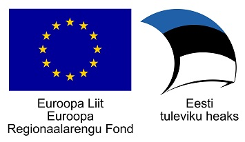



# Build status

[](https://travis-ci.com/open-eid/digidoc4j)

# DigiDoc4j
DigiDoc4j is a Java library for digitally signing documents and creating digital signature containers of signed documents.

# Features
* Creating ASiC-E and BDOC containers
* Validating ASiC-E, BDOC, ASIC-S and DDOC containers
* Creating and validating detached XadES

# How to use it
* Take a look at the [examples](https://github.com/open-eid/digidoc4j/wiki/Examples-of-using-it)
* See the full [DigiDoc4j API](http://open-eid.github.io/digidoc4j/) description
* Explore the [Wiki](https://github.com/open-eid/digidoc4j/wiki) section
* Download the latest [release](https://github.com/open-eid/digidoc4j/releases)
* See the [library development guide](https://github.com/open-eid/digidoc4j/wiki/Development). Your contribution and pull requests are more than welcome

# ASiC-E (Associated Signature Container Extended) container format
* Has **.asice** or **.sce** extension.
* This format is default format since 2019.
* ASIC-E containers are in compliance with EU standards.
* Signatures are stored in **XAdES** format.
* Supports following signature formats:
  * **LT** (Long Term) - Signature with **time-stamp** and **OCSP** (both "regular" and AIA OCSP are supported).
  * **LTA** (Long Term Archival) -  signature format has additional **archival time-stamp** to LT profile.
* **.asice** or **.sce** file is in fact a ZIP container with the signed files, the signatures and the protocol control information and can basically be opened by any program that recognizes the ZIP format.
* It is recommended not to use special characters in the data file’s name, i.e. it is suggested to use only the characters that are categorized as “unreserved” according to RFC3986 (http://tools.ietf.org/html/rfc3986).

# BDOC (Estonian specific implementation of Associated Signature Container Extended) container format
* Has **.bdoc** extension
* BDOC is a digital signature format developed in 2014 to replace the old, DDOC (DigiDoc) digital signature format.
* This format has been used as a default digital signature format in Estonia since 2015 until end of 2018.
* BDOC container is based on **ASiC-E** standard.
* Signatures are stored in **XAdES** format.
* Supports signature formats: 
  * **LT_TM** (Long Term TimeMark) - signature has **time-mark** ensuring long-term provability of the authenticity of the signature.
    * It is based on **XAdES baseline LT** signature format.
* **.bdoc** file is in fact a ZIP container with the signed files, the signatures and the protocol control information and can basically be opened by any program that recognizes the ZIP format.
* It is recommended not to use special characters in the data file’s name, i.e. it is suggested to use only the characters that are categorized as “unreserved” according to RFC3986 (http://tools.ietf.org/html/rfc3986).

# ASiC-S (ASiC-E - Associated Signature Container Simple) container format
* Has **.asics** or **.scs** extension
* Container associates one data file with either:
  - one signature file containing one or more detached digital signature(s) that apply to it; or
  - one time assertion file containing a time assertion that apply to it.
* This format is used for timestamping the old DDOC containers in order to prove the inviolability of documents.

# DDOC container format
* Has **.ddoc** extension
* An old DigiDoc digital signature format
* Since year 2015 it's recommended not to sign documents in the DDOC format
* It is based on XML Advanced Electronic Signatures (**XAdES**) format, corresponding to  profile XAdES-X-L
* The DigiDoc container includes the source files (the files that were signed) as well as the signatures that are related to the signed file(s)
* Every signature contains the certificate, validity confirmation and the validity confirmation service certificate.

# Documentation
* [DigiDoc4j API](http://open-eid.github.io/digidoc4j/)
* [Examples](https://github.com/open-eid/digidoc4j/wiki/Examples-of-using-it)
* [Wiki](https://github.com/open-eid/digidoc4j/wiki)
* [Architecture of ID-software](http://open-eid.github.io/)
* [Digital signature formats](http://www.id.ee/index.php?id=36108)
* [BDOC 2.1.2 specification](http://id.ee/public/bdoc-spec212-eng.pdf)
* [DDOC specification](http://www.id.ee/public/DigiDoc_format_1.3.pdf)

# Requirements
* Java **8** (since version 4.0.0-RC.1)
* Internet access to external verification services
 * OCSP (Online Certificate Status Protocol) - http://ocsp.sk.ee
 * EU TSL (European Commission's Trusted Status List) - https://ec.europa.eu/information_society/policy/esignature/trusted-list/tl-mp.xml
 * All the EU member states' TL servers referred in the EU TSL. Note that this list may change. (e.g. https://sr.riik.ee/tsl/estonian-tsl.xml, https://sede.minetur.gob.es/Prestadores/TSL/TSL.xml, https://www.viestintavirasto.fi/attachments/TSL-Ficora.xml etc.)
 * TSA (Time Stamping Authority) - http://tsa.sk.ee

## Maven
You can use the library as a Maven dependency from the Maven Central (http://mvnrepository.com/artifact/org.digidoc4j/digidoc4j)

```xml
<dependency>
	<groupId>org.digidoc4j</groupId>
	<artifactId>digidoc4j</artifactId>
	<version>4.x.x</version>
</dependency>
```

# Licence
* LGPL (GNU Library General Public License, see LICENSE.LGPL)
* © Estonian Information System Authority

## Support
Official builds are provided through [releases](https://github.com/open-eid/digidoc4j/releases). If you want support, you need to be using official builds. Contact for assistance by email [help@ria.ee](mailto:help@ria.ee). 
Additional information can be found in [wiki Q&A](https://github.com/open-eid/digidoc4j/wiki/Questions-&-Answers) and on [ID.ee portal](https://www.id.ee/rubriik/digidoc-teegid/).

Source code is provided on "as is" terms with no warranty (see license for more information). Do not file Github issues with generic support requests.
